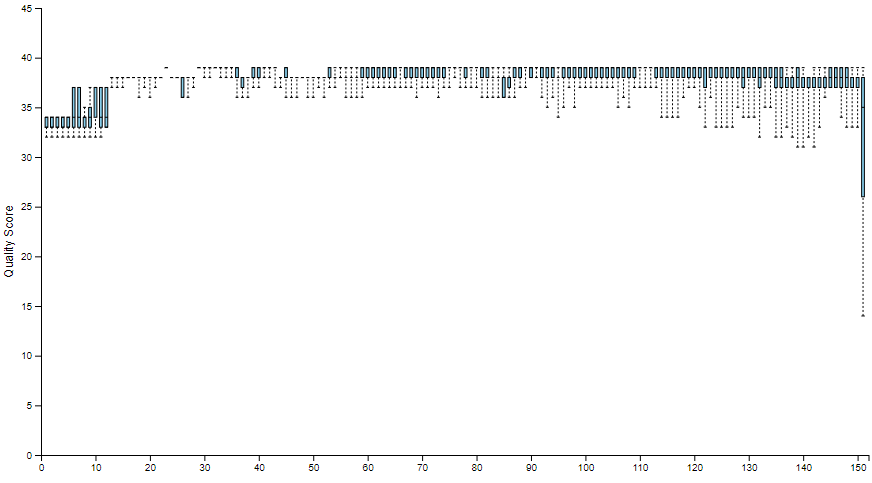
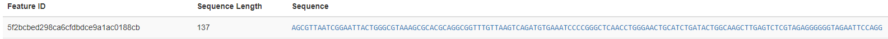
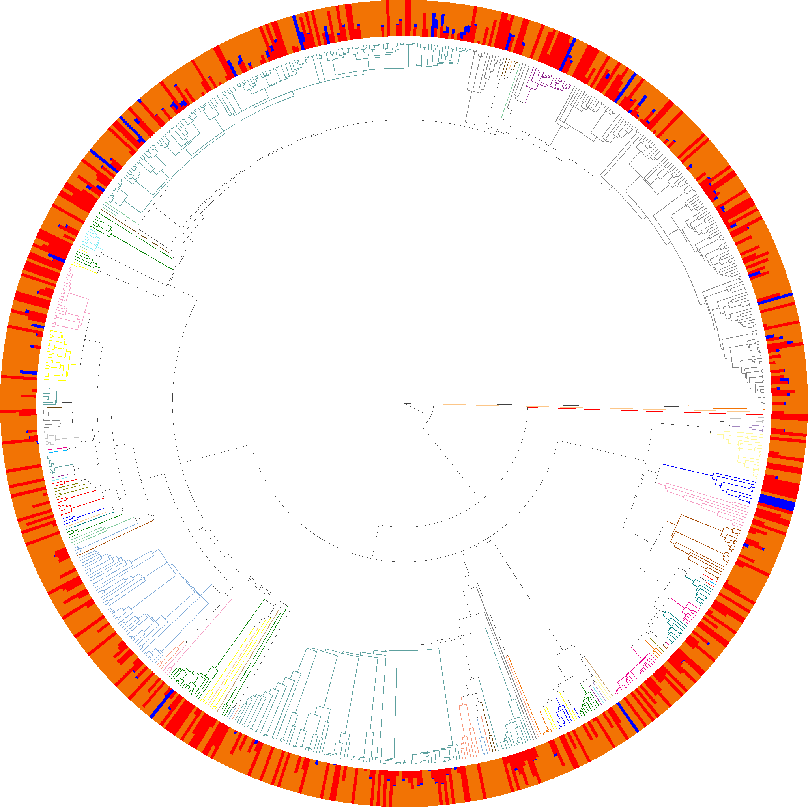
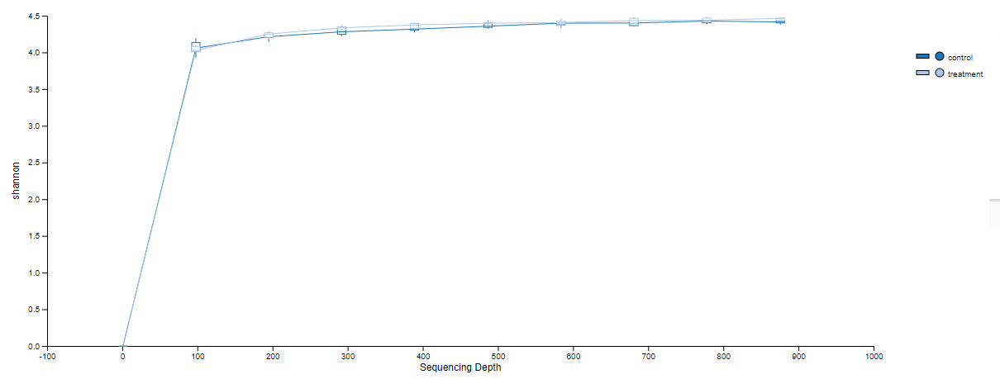

# Bioinformatics Final Presentation
Kaleb Ducharme

---

# Outline

- Background Information
- Methods
- Results
- Final Remarks
- Bibliography

---

# Background Information

Original Data from:

###### Kang, DW., Adams, J.B., Gregory, A.C. et al. Microbiota Transfer Therapy alters gut ecosystem and improves gastrointestinal and autism symptoms: an open-label study. Microbiome 5, 10 (2017). https://doi.org/10.1186/s40168-016-0225-7

- tested how fecal transplants would affect gastrointestinal and autistic symptoms
- treatment group got fecal transplant, while control did not
    - collected fecal and swab microbiome data every couple weeks

---

# Background Information

- Microbiome data extraction and sequencing
    - DNA isolated
    - 16S rRNA library prep
    - barcoded primer 515f-806r
        - targets 16S V4 region
        - amplify bacterial/ archaeal 16S rRNA genes
- used 10% of data across 2 Illumina MiSeq runs
---

# Methods

---

# Methods

### Importing Data

- download fastq files using `curl` (already demultiplexed)
- remove poly-G tail and filter reads using `fastp`
- import fastq files into readable format using `tools import`
- trim primers using `cutadapt trim-single`
 
- do once per run (2 runs total)

---

# Methods

### Denoising Prep

- `demux summarize` used to determine best way to denoise
    - left 13, length 150

---

# Methods

### Denoising

- `dada2 denoise-single`
    - infers amplicon sequence variants (ASVs) from sequences
    - atempts to reduce noise from sources such as sequencing errors

- `metadata tabulate` and `feature-table tabulate-seqs` 
    - shows denoising statistics and resulting feature IDs, sequence, and their counts

---

# Methods

### Merging

- `feature-table merge` and `feature-table merge-seqs` merge the two runs into one feature table and sequence file respectivly

### Alignment

- `alignment mafft` and `alignment mask` aligns the features in the feature table and removes highly variable positions that add too much noise

---

# Methods

### Taxanomic Assignment

- used a [pre-trained classifier](https://zenodo.org/record/6395539#.ZGWvGXbMJhF) on the SILVA rRNA database with `feature-classifier classify-sklearn`
    - takes the sequences from this study and compares them to the labeled sequences in the database, and outputs the taxonomic information and confidence on each feature in the feature table

 
 

---

# Methods

### Phylogenetic Tree Creation

- `phylogeny fasttree` creates an unrooted tree
- `phylogeny midpoint-root` creates a rooted tree from the unrooted tree
- `empress community-plot` uses the rooted tree, taxonomic information, metadata, and feature table to create a rooted tree visualization.

---

# Results

### Phylogenetic Tree

---

# Methods

### Diversity Statistics

- first, R was used to filter out metadata columns with missing values
- `feature-table filter-samples` was used to remove donor values from the metadata
    - the next steps cannot have null values
- core diversity metrics were generated using `core-metrics-phylogenetic`
    - alpha: observed features, Faith's Phylogenetic Diversity, Shannon Diversity, Pielou's evenness
        - within sample diversity
    - beta: UniFrac, Jaccard, Bray-Curtis
        - between sample differences in diveristy

---

# Methods

### Rarefaction Plot

- shows if selected sequencing depth used in previous step (876) likely contains majority of the species present

---

# Methods

