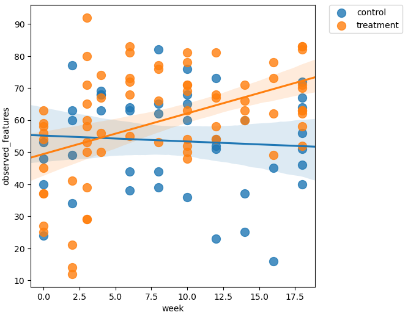

# Bioinformatics Final Presentation
Kaleb Ducharme

---

# Outline

- Background Information
- Methods
- Results
- Final Remarks
- Bibliography

---

# Background Information

Original Data from:

###### Kang, DW., Adams, J.B., Gregory, A.C. et al. Microbiota Transfer Therapy alters gut ecosystem and improves gastrointestinal and autism symptoms: an open-label study. Microbiome 5, 10 (2017). https://doi.org/10.1186/s40168-016-0225-7

- tested how fecal transplants would affect gastrointestinal and autistic symptoms
- treatment group got fecal transplant, while control did not
    - collected fecal and swab microbiome data every couple weeks

---

# Background Information

- Microbiome data extraction and sequencing
    - DNA isolated
    - 16S rRNA library prep
    - barcoded primer 515f-806r
        - targets 16S V4 region
        - amplify bacterial/ archaeal 16S rRNA genes
- used 10% of data across 2 Illumina MiSeq runs
---

# Methods


---

# Methods

### Importing Data

- download fastq files using `curl` (already demultiplexed)
- remove poly-G tail and filter reads using `fastp`
- import fastq files into readable format using `tools import`
- trim primers using `cutadapt trim-single`
<br />
- do once per run (2 runs total)

---

<style>
    background-image-padding: 1px;
</style>

# Methods

### Denoising Prep

- `demux summarize` used to determine best way to denoise
    - left 13, length 150


---

# Methods

### Denoising

- `dada2 denoise-single`
    - infers amplicon sequence variants (ASVs) from sequences
    - atempts to reduce noise from sources such as sequencing errors

- `metadata tabulate` and `feature-table tabulate-seqs` 
    - shows denoising statistics and resulting feature IDs, sequence, and their counts


---

# Methods

### Merging

- `feature-table merge` and `feature-table merge-seqs` merge the two runs into one feature table and sequence file respectivly

### Alignment

- `alignment mafft` and `alignment mask` aligns the features in the feature table and removes highly variable positions that add too much noise

---

# Methods

### Taxanomic Assignment

- used a [pre-trained classifier](https://zenodo.org/record/6395539#.ZGWvGXbMJhF) on the SILVA rRNA database with `feature-classifier classify-sklearn`
    - takes the sequences from this study and compares them to the labeled sequences in the database, and outputs the taxonomic information and confidence on each feature in the feature table

<br />
<br />


---

# Methods

### Phylogenetic Tree Creation

- `phylogeny fasttree` creates an unrooted tree
- `phylogeny midpoint-root` creates a rooted tree from the unrooted tree
- `empress community-plot` uses the rooted tree, taxonomic information, metadata, and feature table to create a rooted tree visualization.

---

# Results

### Phylogenetic Tree


---

# Methods

### Diversity Statistics

- first, R was used to filter out metadata columns with missing values
- `feature-table filter-samples` was used to remove donor values from the metadata
    - the next steps cannot have null values
- core diversity metrics were generated using `diversity core-metrics-phylogenetic`
    - alpha: observed features, Faith's Phylogenetic Diversity, Shannon Diversity, Pielou's evenness
        - within sample diversity
    - beta: UniFrac, Jaccard, Bray-Curtis
        - between sample differences in diveristy


---

# Methods

### Rarefaction Plot

- generated with `diversity alpha-rarefaction`
- shows if selected sequencing depth contains majority of the species present


---

# Methods

### Alpha Diversity

- `diversity alpha-group-significance` used to create boxplots with observed features alpha metric against metadata variables
- `longitudinal linear-mixed-effects` used to create linear mixed effects model to probe further into the treatment group relationship seen in the boxplots

---

# Results

### Alpha Diversity

- Observed Features metric
- Shows microbiome richness differences between groups


---

# Results

### Alpha Diversity

- Treatment + Time only significant predictor of microbiome richness
- As time progressed, the treatment group's gut microbiome became more diverse



---

# Methods

### Beta Diversity

- `diversity umap` used to reduce dimensions of unifrac diversity metrics
- `emperor plot` used with umap output and metadata to create scatterplot

---

# Results

### Beta Diversity

- Unweighted Unifrac
- More sensitive to rare OTUs


---

# Results

### Beta Diversity

- Weighted Unifrac
- More sensitive to abundant taxa


---

# Methods

### Longitudinal Analysis

- `longitudinal volatility` used to produce longitudinal plot that combines the metadata, all diversity metrics, relative frequency table, and taxonomic information into a plot that tracks all variables including individual taxa in each sample across time. 

``` bash
qiime longitudinal volatility \
  --i-table mergedRepSequences/clean-no-donor-genus-relFreq-table.qza \
  --p-state-column week \
  --m-metadata-file metadata/clean-metadata.tsv core-metrics/uu-umap.qza core-metrics/faith_pd_vector.qza core-metrics/evenness_vector.qza core-metrics/shannon_vector.qza \
  --p-individual-id-column subject-id \
  --p-default-group-column treatment-group \
  --o-visualization longitudinal/volatility-plot.qzv
```

---

# Results

### Longitudial Analysis


---

# Results

### Longitudinal Analysis


---

# Final Remarks

- qiime2 is a powerful bioinformatics tool
- please put the empress tool on ron
- all code used in this project and short explanations for each tool are found in my [github repo](https://github.com/Kale-23/gen711_final#-methods-)

---

# Bibliography

```
Kang, DW., Adams, J.B., Gregory, A.C. et al. Microbiota Transfer Therapy alters gut ecosystem and improves gastrointestinal and autism symptoms: an open-label study. Microbiome 5, 10 (2017). https://doi.org/10.1186/s40168-016-0225-7

Bolyen, Evan, Jai Ram Rideout, Matthew R. Dillon, Nicholas A. Bokulich, Christian C. Abnet, Gabriel A. Al-Ghalith, Harriet Alexander, et al. ‘Reproducible, Interactive, Scalable and Extensible Microbiome Data Science Using QIIME 2’. Nature Biotechnology 37, no. 8 (2019): 852–57. https://doi.org/10.1038/s41587-019-0209-9.

McDonald, Daniel, Jose C. Clemente, Justin Kuczynski, Jai Ram Rideout, Jesse Stombaugh, Doug Wendel, Andreas Wilke, et al. ‘The Biological Observation Matrix (BIOM) Format or: How I Learned to Stop Worrying and Love the Ome-Ome’. GigaScience 1, no. 1 (2012): 7. https://doi.org/10.1186/2047-217X-1-7.

McKinney, Wes. ‘Data Structures for Statistical Computing in Python’. In Proceedings of the 9th Python in Science Conference, edited by Stéfan van der Walt and Jarrod Millman, 51–56, 2010.

Bokulich, Nicholas A., Matthew R. Dillon, Yilong Zhang, Jai Ram Rideout, Evan Bolyen, Huilin Li, Paul S. Albert, and J. Gregory Caporaso. ‘Q2-Longitudinal: Longitudinal and Paired-Sample Analyses of Microbiome Data’. MSystems 3, no. 6 (2018): e00219-18. https://doi.org/10.1128/mSystems.00219-18.

Callahan, Benjamin J., Paul J. McMurdie, Michael J. Rosen, Andrew W. Han, Amy Jo A. Johnson, and Susan P. Holmes. ‘DADA2: High-Resolution Sample Inference from Illumina Amplicon Data’. Nature Methods 13, no. 7 (2016): 581. https://doi.org/10.1038/nmeth.3869.

Price, Morgan N., Paramvir S. Dehal, and Adam P. Arkin. ‘FastTree 2--Approximately Maximum-Likelihood Trees for Large Alignments’. PloS One 5, no. 3 (2010): e9490. https://doi.org/10.1371/journal.pone.0009490.

Lane, D. J. ‘16S/23S RRNA Sequencing’. In Nucleic Acid Techniques in Bacterial Systematics, edited by E. Stackebrandt and M. Goodfellow, 115–75. New York: John Wiley and Sons, 1991.

Katoh, Kazutaka, and Daron M. Standley. ‘MAFFT Multiple Sequence Alignment Software Version 7: Improvements in Performance and Usability’. Molecular Biology and Evolution 30, no. 4 (2013): 772–80. https://doi.org/10.1093/molbev/mst010.

Lozupone, Catherine, and Rob Knight. ‘UniFrac: A New Phylogenetic Method for Comparing Microbial Communities’. Applied and Environmental Microbiology 71, no. 12 (2005): 8228–35. https://doi.org/10.1128/AEM.71.12.8228-8235.2005.

Lozupone, Catherine A., Micah Hamady, Scott T. Kelley, and Rob Knight. ‘Quantitative and Qualitative β Diversity Measures Lead to Different Insights into Factors That Structure Microbial Communities’. Applied and Environmental Microbiology 73, no. 5 (2007): 1576–85. https://doi.org/10.1128/AEM.01996-06.

Hamady, Micah, Catherine Lozupone, and Rob Knight. ‘Fast UniFrac: Facilitating High-Throughput Phylogenetic Analyses of Microbial Communities Including Analysis of Pyrosequencing and PhyloChip Data’. The ISME Journal 4 (2010): 17–27. https://doi.org/10.1038/ismej.2009.97.

Lozupone, Catherine, Manuel E. Lladser, Dan Knights, Jesse Stombaugh, and Rob Knight. ‘UniFrac: An Effective Distance Metric for Microbial Community Comparison’. The ISME Journal 5 (2011): 169–72. https://doi.org/10.1038/ismej.2010.133.

McDonald, Daniel, Yoshiki Vázquez-Baeza, David Koslicki, Jason McClelland, Nicolai Reeve, Zhenjiang Xu, Antonio Gonzalez, and Rob Knight. ‘Striped UniFrac: Enabling Microbiome Analysis at Unprecedented Scale’. Nature Methods 15 (2018): 847–48. https://doi.org/10.1038/s41592-018-0187-8.

Weiss, Sophie, Zhenjiang Zech Xu, Shyamal Peddada, Amnon Amir, Kyle Bittinger, Antonio Gonzalez, Catherine Lozupone, et al. ‘Normalization and Microbial Differential Abundance Strategies Depend upon Data Characteristics’. Microbiome 5, no. 1 (March 2017): 27. https://doi.org/10.1186/s40168-017-0237-y.

Faith, Daniel P. ‘Conservation Evaluation and Phylogenetic Diversity’. Biological Conservation 61, no. 1 (1992): 1–10. https://doi.org/10.1016/0006-3207(92)91201-3.

Armstrong, George, Kalen Cantrell, Shi Huang, Daniel McDonald, Niina Haiminen, Anna Paola Carrieri, Qiyun Zhu, et al. ‘Efficient Computation of Faith’s Phylogenetic Diversity with Applications in Characterizing Microbiomes’. Genome Research 31, no. 11 (2021): 2131–37. https://doi.org/10.1101/gr.275777.121.

Pielou, Evelyn C. ‘The Measurement of Diversity in Different Types of Biological Collections’. Journal of Theoretical Biology 13 (1966): 131–44. https://doi.org/10.1016/0022-5193(66)90013-0.

Shannon, Claude E. ‘A Mathematical Theory of Communication’. The Bell System Technical Journal 27 (1948): 379–423, 623--656. https://doi.org/10.1002/j.1538-7305.1948.tb01338.x.

Pedregosa, Fabian, Gaël Varoquaux, Alexandre Gramfort, Vincent Michel, Bertrand Thirion, Olivier Grisel, Mathieu Blondel, et al. ‘Scikit-Learn: Machine Learning in Python’. Journal of Machine Learning Research 12, no. Oct (2011): 2825–30.

Bokulich, Nicholas A., Benjamin D. Kaehler, Jai Ram Rideout, Matthew Dillon, Evan Bolyen, Rob Knight, Gavin A. Huttley, and J. Gregory Caporaso. ‘Optimizing Taxonomic Classification of Marker-Gene Amplicon Sequences with QIIME 2’s Q2-Feature-Classifier Plugin’. Microbiome 6, no. 1 (2018): 90. https://doi.org/10.1186/s40168-018-0470-z.

Robeson, Michael S., Devon R. O\textquoterightRourke, Benjamin D. Kaehler, Michal Ziemski, Matthew R. Dillon, Jeffrey T. Foster, and Nicholas A. Bokulich. ‘RESCRIPt: Reproducible Sequence Taxonomy Reference Database Management’, 2021. https://doi.org/10.1371/journal.pcbi.1009581.

Rognes, Torbjørn, Tomáš Flouri, Ben Nichols, Christopher Quince, and Frédéric Mahé. ‘VSEARCH: A Versatile Open Source Tool for Metagenomics’. PeerJ 4 (2016): e2584. https://doi.org/10.7717/peerj.2584.

Pruesse, Elmar, Christian Quast, Katrin Knittel, Bernhard M. Fuchs, Wolfgang Ludwig, Jorg Peplies, and Frank Oliver Glockner. ‘SILVA: A Comprehensive Online Resource for Quality Checked and Aligned Ribosomal RNA Sequence Data Compatible with ARB’. Nucleic Acids Res 35, no. 21 (2007): 7188–96.

Quast, Christian, Elmar Pruesse, Pelin Yilmaz, Jan Gerken, Timmy Schweer, Pablo Yarza, Jorg Peplies, and Frank Oliver Glockner. ‘The SILVA Ribosomal RNA Gene Database Project: Improved Data Processing and Web-Based Tools’. Nucleic Acids Res 41, no. Database issue (2013): D590-6.

———. ‘Optimizing Taxonomic Classification of Marker-Gene Amplicon Sequences with QIIME 2’s Q2-Feature-Classifier Plugin’. Microbiome 6, no. 1 (2018): 90.

Kaehler, Benjamin D., Nicholas Bokulich, Daniel McDonald, Rob Knight, J. Gregory Caporaso, and Gavin A. Huttley. ‘Species Abundance Information Improves Sequence Taxonomy Classification Accuracy’. Nature Communications 10, no. 4643 (2019).
```